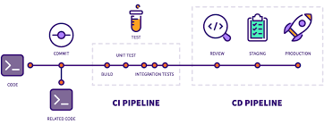

# Automated CI/CD

_부제: Build Test Deploy 자동화로 Full Cycle Dev 환경 구축하기_

 

목차 

* 구성요소 (Components / v1.0.0)

    * SCM: Gitlab Server 

    * Private NPM Repository: Gitlab Server

    * CI / CD Tools: Jenkins

    * Deploy: Ubuntu 18.04 + Nginx

* 회고 (Retrospective)

* 구축 과제 (Todo / v2.0.0)

    * Container Image Repository: Docker Registry

    * Container Orchestration: Kubernetes Cluster

 

### 1. 구성요소 (Components)

 

🚩 &nbsp; **_SCM (Source Code Management)_** :   

* SCM은 설치형 Gitlab EE 서비스를 이용함

* 1차 저장소

    * Dev PC(MacOS Sierra)의 VM Instance (Ubuntu 18.04 Virtual Box)
 
* 2차 저장소(Mirroring Repo)

    * Deploy Server(Z800 Workstation)의 VM Instance (Ubuntu 18.04 VirtualBox)

    * Bridged Network로 노출시켜 Dev PC의 VM Instance 망에서 접근 가능하도록 설정함

    * Mirroring은 Gitlab에서 제공하는 기능을 이용함

 

🚩 &nbsp; **_Private NPM repo_** :   

* 개인 프로젝트 개발시 외부 라이브러리 사용을 최소화 하는 것이 목표이므로, 유틸 패키지를 따로 관리할 유인이 생겼음

* NPM repository는 Gitlab의 NPM repository 서비스를 이용하였음

 

🚩 &nbsp; **_CI (Continuos Integration) / CD (Continuous Delivery)_** :   a

* CI / CD 툴은 Jenkins를 이용함

* Gitlab Webhook과 연동시켜 메인 브랜치에 Push Event 발생시 빌드, 테스트, 배포가 트리거 되도록 설정함

* Dev PC(MacOS Sierra)에서 빌드, 테스트를 진행하고, 서버(Z800 Workstation, Ubuntu 18.04)에는 배포만 함

* Jenkins은 1개의 Master Node(VirtualBox + Ubuntu 18.04)와 1개의 Agent Node(VirtualBox + Ubuntu 18.04)로 구성하였음

 

🚩 &nbsp; **_Deploy_** :   

* Deploy는 Jenkins의 Bash Shell Remote Execution을 이용

* 도메인은 Hostinger에서 http://portfolio-y0711.com 을 구매하고, 네임 서버는 DNSzi.com의 서비스를 이용함

* 사용 중인 ISP(Dlive)에서 public IP Address의 80 포트 사용을 허용하지 않아 81포트를 포트포워딩하고 이를 Nginx에 연결함

* Static Website는 Node Express와 같은 별도의 서버 환경을 구성하지 않고, Nginx 설정으로 직접 배포함

* Microservice는 8000 포트에 배포하고, Nginx에 Reverse Proxy로 연동시킬 예정임

 

### 2. 회고 (Retrospective)

* 항상 그렇듯이 설치 과정은 많은 인내심과 인터넷 검색을 요구하는 작업임

* Clean 설치를 위해 최소 설치된 Cloneable 인스턴스를 만들어 두는 것이 유효했음

* 서버 환경에 바로 적용 가능한 zsh, ohmyzsh, nvm, neovim 설치 및 설정 스크립트를 작성할 예정임

* 알수 없는 이유로 Gitlab EE 최신 버전이 Ubuntu 18.04에서 작동하지 않아, 서버에는 개발 PC에서 사용중이던 13.5.3-ee 버전을 설치함 

* 2021년 초 30만원 주고 구매한 Z800 구형 서버의 성능이 생각보다 좋지 않아, 서버 교체시까지는 빌드, 테스트 같은 연산 작업을 주로 개발 pc의 Jenkins를 이용할 예정임

 

### 3. 구축 과제 (Todo)

 

⛰ &nbsp; **_Container Image Repository_** :   

* 현재 모든 서버는 tshell script 및 ts-node, lsof, curl, kill 등의 명령어로 가동 / 중단을 제어함

* 위와 같은 번거로운 배포 script 작성을 피하고자 향후에는 Dockerized Container 배포 방식을 이용할 예정임

* Private Docker Registry는 Docker를 이용해 쉽게 구성이 가능함

* 초기 구축 단계에서는 Docker Swarm 및 docker-compose.yml을 이용할 예정임

 

⛰ &nbsp; **_Container Orchestration_** :   

* Private Docker Registry 구축 및 마이크로 서비스의 컨테이너화가 완료되면 Kubernetes Cluster를 구축할 예정임

* Kubeadm, Kubelet 등의 프레임워크를 이용하여 클러스터를 구성해보았는데, 서버 성능이 좋지 않아 최대 10개의 인스턴스 생성이 가능하였음

* Dev PC에서 Kubernetes 클러스터의 원격 제어가 가능하도록 인증문제를 해결해야 함

 

